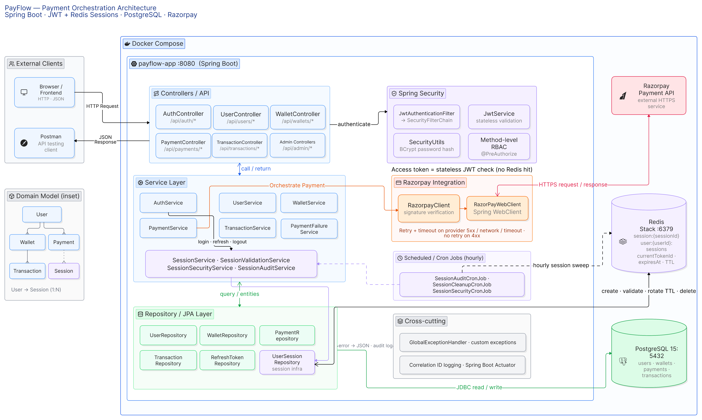
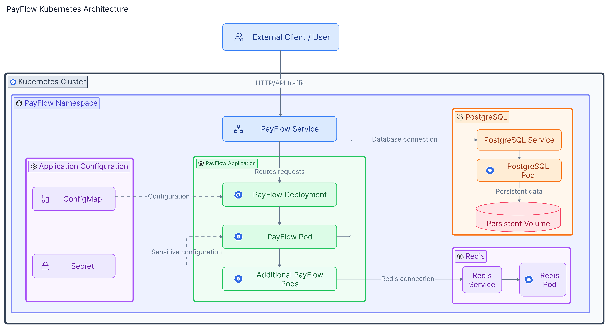

# PayFlow — Payment Orchestration API

> A Spring Boot 4 / Java 21 backend that sits between a client application
and Razorpay, owning wallet state, payment lifecycle, transaction history
and session security while keeping provider-specific communication behind
a single boundary. 
>
>Built around failure cases rather than the happy path: refresh-token
rotation with reuse detection, device- and IP-bound Redis sessions,
retry policy that distinguishes transient provider faults from declines,
correlation IDs traceable across auth, wallet and provider logs, and
duplicate-payment protection before any wallet is credited.


[](#technology-stack)
[](#technology-stack)
[](#standalone-run)
[](#standalone-run)
[](#authentication--authorization)
[](#razorpay-integration)
[](#docker--runtime-architecture)
[](#swagger--openapi)

---

## What you can do in five minutes

| | |
| --- | --- |
| **See it work** | [Payment happy flow (GIF)](docs/happyflow.gif) — login, Razorpay test checkout, signature verification, wallet credit |
| **See the shape** | [Architecture diagram](docs/architecture_diagram.png) · [Kubernetes architecture](docs/architecture_kubernetes_diagram.png) |
| **Run it** | `curl -O https://raw.githubusercontent.com/07Rochak/payflow/main/docker-compose.yml && docker compose up -d` → http://localhost:8080 |
| **Read the API** | [Swagger reference](http://localhost:8080/swagger-ui.html) once running · [Postman collection](docs/Payflow.postman_collection) |

Demo ADMIN login, wallet limits and endpoint reference are below.

---

### Engineering decisions worth reading about

- [Stateless access tokens + stateful Redis refresh sessions](#stateless-access-token--stateful-refresh-session) — why the two tokens have different storage models
- [Refresh-token rotation and reuse detection](#refresh-token-rotation) — a replayed token deletes the session rather than being rejected
- [Razorpay retry policy](#retry-policy) — 5xx, timeouts and network faults retry; a 4xx never does
- [Correlation IDs](#correlation-ids-1) — tracing one payment across six log files without tracing infrastructure
- [Known limitations](#known-limitations) — what is deliberately not implemented

### Runtime

Standalone · Docker Compose · Kubernetes via Skaffold
(HPA, PersistentVolumeClaims, Pod Disruption Budget, readiness/liveness
probes, Gateway API + Envoy). Full Kubernetes documentation: [`docs/kubernetes/`](docs/kubernetes/)

**Status:** development/portfolio implementation with production-oriented
design. See [Production Considerations](#production-considerations) for what
a real deployment would additionally require.

---

## 📑 Table of Contents

- [Project Overview](#project-overview)
- [Key Features](#key-features)
- [Technology Stack](#technology-stack)
- [Architecture](#architecture)
  - [Docker Compose Architecture](#docker-compose-architecture)
  - [Kubernetes Architecture](#kubernetes-architecture)
  - [Architecture Layers](#architecture-layers)
  - [Domain Model](#domain-model)
  - [Kubernetes Architecture](#kubernetes-architecture)
- [Project Structure](#project-structure)
- [Quick Start](#quick-start)
  - [Option 1 — Standalone Application](#option-1--standalone-application)
  - [Option 2 — Complete Docker Compose Setup](#option-2--complete-docker-compose-setup)
  - [Option 3 — Kubernetes Deployment with Skaffold](#option-3--kubernetes-deployment-with-skaffold)
- [Prerequisites](#prerequisites)
  - [Standalone Run](#standalone-run)
  - [Complete Docker Run](#complete-docker-run)
  - [Kubernetes Prerequisites](#kubernetes-prerequisites)
- [Deployment & Kubernetes](#deployment--kubernetes)
  - [Deployment Overview](#deployment-overview)
  - [Kubernetes Overview](#kubernetes-overview)
  - [Kubernetes Commands](#kubernetes-commands)
  - [Kubernetes Validation Status](#kubernetes-validation-status)
- [Configuration & Secrets](#configuration--secrets)
- [Application Access](#application-access)
- [Initial Admin Setup](#initial-admin-setup)
- [Authentication & Authorization](#authentication--authorization)
  - [Registration](#registration)
  - [Login](#login)
  - [JWT Access Tokens](#jwt-access-tokens)
  - [Redis-backed Refresh Sessions](#redis-backed-refresh-sessions)
  - [Refresh Token Rotation](#refresh-token-rotation)
  - [Logout](#logout)
  - [RBAC](#rbac)
- [API Reference](#api-reference)
  - [Authentication](#authentication)
  - [Users](#users)
  - [Wallet](#wallet)
  - [Payments](#payments)
  - [Transactions](#transactions)
  - [Admin — Users](#admin--users)
  - [Admin — Wallets](#admin--wallets)
  - [Admin — Transactions](#admin--transactions)
  - [Actuator](#actuator)
- [Payment Happy Flow](#payment-happy-flow)
  - [Browser Demonstration](#browser-demonstration)
  - [End-to-End Payment Lifecycle](#end-to-end-payment-lifecycle)
- [Razorpay Integration](#razorpay-integration)
  - [Order Creation](#order-creation)
  - [Payment Verification](#payment-verification)
  - [Provider Failure Handling](#provider-failure-handling)
- [Wallet & Transaction Flows](#wallet--transaction-flows)
  - [Wallet Operations](#wallet-operations)
  - [Transfer](#transfer)
  - [Withdrawal](#withdrawal)
  - [Payment to Wallet](#payment-to-wallet)
- [User Management Flows](#user-management-flows)
- [Redis & Session Architecture](#redis--session-architecture)
- [Database Architecture](#database-architecture)
- [Scheduled Jobs](#scheduled-jobs)
- [Exception Handling](#exception-handling)
- [Reliability & Failure Handling](#reliability--failure-handling)
- [Logging & Observability](#logging--observability)
- [Swagger / OpenAPI](#swagger--openapi)
- [Postman API Testing](#postman-api-testing)
- [End-to-End Testing Sequence](#end-to-end-testing-sequence)
- [Automated Testing](#automated-testing)
- [Troubleshooting](#troubleshooting)
- [Security Considerations](#security-considerations)
- [Production Considerations](#production-considerations)
- [Design Decisions](#design-decisions)
- [Known Limitations](#known-limitations)
- [Future Scope](#future-scope)
- [Project Demonstration](#project-demonstration)


## 🔗 Project Links

| Resource                                   | Link                                                                                                                     |
|--------------------------------------------|--------------------------------------------------------------------------------------------------------------------------|
| Source Repository                          | [GitHub](https://github.com/07Rochak/payflow)                                                                            |
| Docker Compose Architecture Diagram        | [`docs/payflow-architecture.png`](https://github.com/07Rochak/payflow/blob/main/docs/architecture_diagram.png)           |
| Kubernetes Docker Architecture Diagram     | [`docs/payflow-architecture.png`](https://github.com/07Rochak/payflow/blob/main/docs/architecture_kubernetes_diagram.png) |
| Payment Happy Flow                         | [`docs/happyflow.gif`](https://github.com/07Rochak/payflow/blob/main/docs/happyflow.gif)                                 |
| Postman Collection                         | [`docs/payflow-postman-collection.json`](https://github.com/07Rochak/payflow/blob/main/docs/Payflow.postman_collection)  |
| Docker Compose                             | [`docker-compose.yml`](https://github.com/07Rochak/payflow/blob/main/docker-compose.yml)                                 |
| Swagger UI                                 | [localhost:8080/swagger-ui.html](http://localhost:8080/swagger-ui.html)                                                  |
| OpenAPI JSON                               | [localhost:8080/v3/api-docs](http://localhost:8080/v3/api-docs)                                                          |
| PayFlow App (on DockerHub)                 | `07rochak/payflow:1.1.0` |
| PostgreSQL (with seed data) (on DockerHub) | `07rochak/payflow-postgres:latest` |
| Redis (on DockerHub)               | `07rochak/payflow-redis:latest` |  

---

# Project Overview

> **Deployment note:** This README documents the current PayFlow implementation and its intended runtime architecture. Production deployment still requires environment-specific secrets, managed infrastructure, TLS, monitoring, backups, and operational controls.


## What is PayFlow?

PayFlow is a backend payment orchestration service designed to sit between a client application and a payment service provider.

The application provides a single backend boundary for:

- authentication and authorization
- user management
- Redis-backed session lifecycle management
- wallet operations
- payment order creation
- Razorpay payment verification
- transaction recording
- payment failure handling
- scheduled session auditing and cleanup
- application health and metrics

The core idea is to keep provider-specific payment communication behind PayFlow while maintaining PayFlow's own persistent payment, wallet, and transaction state.

Every API interaction follows the request/response model:

```text
Client
  ↓ HTTP Request
PayFlow API
  ↓
Business Processing
  ↓
HTTP Response
  ↓
Client
```

For payment operations, the internal processing may additionally communicate with Razorpay, PostgreSQL, and Redis before PayFlow returns the final response to the caller.

## Core Responsibilities

### Application responsibilities

PayFlow owns:

- User accounts
- Roles and authorization
- Wallets
- Payments
- Transactions
- Authentication
- Refresh-token sessions
- Payment verification
- Provider communication
- Business validation
- Failure handling
- Session maintenance

### Payment-provider responsibility

Razorpay is the external payment provider. It provides the payment order/checkout infrastructure and returns payment information to PayFlow.

PayFlow then verifies the returned payment signature and updates its own domain state.

---

# Key Features

## Authentication & Security

- User registration
- JWT-based authentication
- Short-lived access-token configuration
- Stateful refresh-token sessions in Redis
- Refresh-token rotation
- Refresh-token reuse detection
- Session expiration
- Maximum session lifetime
- Device validation
- IP validation
- Concurrent-session limits
- BCrypt password hashing
- Role-based authorization
- Session invalidation on security-sensitive account changes

## User Management

- Public USER registration
- Authenticated profile update
- Password change
- Email-change handling
- ADMIN user listing
- ADMIN user lookup
- ADMIN provisioning of additional ADMIN accounts

## Wallet

- Wallet creation during user registration
- Own-wallet lookup
- Money transfers
- Withdrawals
- Wallet freeze/unfreeze
- Maximum wallet balance
- Daily transfer limit
- Daily withdrawal limit
- Insufficient-balance validation
- Frozen-wallet validation

## Payments

- Razorpay order creation
- PayFlow payment persistence
- Razorpay order ID tracking
- Razorpay payment ID tracking
- Payment status lifecycle
- Razorpay signature verification
- Duplicate-payment protection
- Payment failure reasons
- Wallet credit after successful verification
- Payment-to-transaction recording

## Transactions

- User transaction history
- Transfer transactions
- Wallet-related transactions
- Payment-related transaction references
- ADMIN transaction inspection
- Transaction status/category/type

## Session Operations

- Session creation
- Session lookup
- Session deletion
- Delete-all-sessions support
- Session rotation
- TTL reset after refresh
- Orphan-session cleanup
- Session audit reporting
- Session security reporting

## Reliability

- Razorpay WebClient integration
- Retry on transient provider/network failures
- Timeout handling
- No blind retry for normal provider `4xx` responses
- Centralized exception handling
- Correlation IDs

## Observability

- Correlation-ID propagation
- Spring Boot Actuator
- Health
- Info
- Metrics
- Scheduled session reports

## Containerization & Kubernetes
- Docker-based application containerization
- Docker Compose-based local multi-container setup
- Kubernetes deployment for PayFlow
- Kubernetes Deployments for PayFlow, PostgreSQL and Redis
- Kubernetes Services for internal application communication
- ConfigMap-based application configuration
- Secret-based sensitive configuration
- PersistentVolumeClaims for persistent application storage
- Kubernetes readiness and liveness probes
- Kubernetes pod self-healing
- Rolling updates through Kubernetes Deployments
- Horizontal Pod Autoscaler configuration
- Pod Disruption Budget configuration
- Gateway API and HTTPRoute configuration
- Skaffold-based Kubernetes build and deployment workflow
- Maven test gate before container deployment through Skaffold

---

# Technology Stack

| Area | Technology | Purpose |
|---|---|---|
| Language | Java 21 | Backend development |
| Framework | Spring Boot 4.0.5 | Application framework |
| Web | Spring MVC + WebFlux | REST API + reactive provider client |
| Security | Spring Security | Authentication and authorization |
| Authentication | JWT / JJWT 0.12.5 | Access and refresh tokens |
| Password hashing | BCrypt | Password protection |
| Database | PostgreSQL 15 | Persistent domain state |
| Persistence | Spring Data JPA / Hibernate | Database access |
| Session store | Redis Stack Server | Stateful session management |
| Payment provider | Razorpay | External payment processing |
| Provider client | Spring WebClient | Razorpay HTTP communication |
| Razorpay SDK | razorpay-java 1.4.8 | Razorpay integration support |
| API documentation | Springdoc OpenAPI 3.0.3 | Swagger/OpenAPI |
| Monitoring | Spring Boot Actuator | Health, info and metrics |
| Build | Maven | Build and dependency management |
| Containerization | Docker | Application and dependency containerization |
| Local orchestration | Docker Compose | Local multi-container development environment |
| Container orchestration | Kubernetes | Deployment and runtime orchestration |
| Kubernetes packaging/workflow | Skaffold | Build, tag, test and deploy workflow |
| Kubernetes networking | Gateway API / HTTPRoute | HTTP routing to the PayFlow application |
| Kubernetes gateway implementation | Envoy Gateway | Gateway implementation for local Kubernetes routing |
| Kubernetes scaling | Horizontal Pod Autoscaler | CPU and memory-based replica scaling configuration |
| Kubernetes availability | Pod Disruption Budget | Availability protection during voluntary disruptions |
| Kubernetes storage | PersistentVolumeClaims | Persistent storage for application components |

---

# Architecture

PayFlow has two deployment environments:

1. Docker Compose-based local environment
2. Kubernetes-based container orchestration environment

## Docker Compose Architecture



The architecture diagram is the primary visual reference for PayFlow. It shows the application boundary, API layer, security, business services, repositories, PostgreSQL, Redis, Razorpay, scheduled jobs, cross-cutting concerns, Docker Compose runtime, request/response directions, and the compact domain model.

The diagram intentionally avoids listing every Java class. The sections below explain the responsibilities represented in the diagram.
## Kubernetes Architecture



PayFlow can also run on a local Kubernetes cluster using Kubernetes Deployments, Services, ConfigMaps, Secrets, PersistentVolumeClaims, readiness and liveness probes, and Skaffold-based deployment automation.

The main components are:

- **PayFlow Deployment:** Runs the Spring Boot application pods.
- **PayFlow Service:** Provides stable internal access to the PayFlow pods.
- **PostgreSQL Deployment:** Runs the PostgreSQL database container.
- **PostgreSQL Service:** Provides internal access to PostgreSQL.
- **PostgreSQL PersistentVolumeClaim:** Provides persistent storage for PostgreSQL data.
- **Redis Deployment:** Runs the Redis container.
- **Redis Service:** Provides internal access to Redis.
- **Redis PersistentVolumeClaim:** Provides persistent storage for Redis data.
- **PayFlow logs PersistentVolumeClaim:** Provides persistent storage for application logs where configured.
- **ConfigMap:** Stores non-sensitive application configuration.
- **Secret:** Stores sensitive configuration such as credentials or secret values.
- **Horizontal Pod Autoscaler:** Defines the scaling range and resource utilization targets for PayFlow.
- **Pod Disruption Budget:** Limits voluntary disruption of PayFlow pods.
- **Gateway:** Defines the Kubernetes Gateway API entry point.
- **HTTPRoute:** Defines HTTP routing from the Gateway to the PayFlow Service.
- **ServiceAccount:** Provides the identity used by the relevant Kubernetes workload.

## Architecture Layers

### 1. Client / API Boundary

PayFlow exposes REST APIs to clients.

The project also contains a small browser-based Razorpay test checkout page at:

```text
/
```

The same APIs can be exercised through Postman.

### 2. Controller Layer

Controllers form the REST API boundary.

```text
AuthController
UserController
WalletController
PaymentController
TransactionController

AdminUserController
AdminWalletController
AdminTransactionController
```

Controllers:

- receive HTTP requests
- validate request DTOs
- resolve authenticated user identity where required
- delegate business operations to services
- return HTTP responses

### 3. Security Layer

Security is implemented using Spring Security, a JWT authentication filter, JWT services, and method-level authorization.

```text
HTTP Request
    ↓
JwtAuthenticationFilter
    ↓
JWT validation
    ↓
SecurityContext
    ↓
Controller / @PreAuthorize
```

The access-token path is stateless.

The refresh-token path is stateful through Redis sessions.

### 4. Service Layer

The service layer contains the application's business logic and orchestration.

Main business services include:

```text
AuthService
UserService
WalletService
PaymentService
TransactionService
PaymentFailureService
```

Session responsibilities are separated into:

```text
SessionService
SessionValidationService
SessionAuditService
SessionSecurityService
```

### 5. Repository Layer

The persistence boundary includes:

```text
UserRepository
WalletRepository
PaymentRepository
TransactionRepository
RefreshTokenRepository
UserSessionRepository
```

PostgreSQL stores durable application/domain state.

Redis repositories manage session state.

### 6. Payment Integration Layer

Razorpay communication is separated from core payment business logic:

```text
PaymentService
      ↓
RazorpayClient
      ↓
RazorPayWebClient
      ↓
Spring WebClient
      ↓ HTTPS
Razorpay API
      ↓ HTTPS Response
PayFlow
```

### 7. Redis Session Infrastructure

Redis is used for refresh-session state rather than durable business records.

The session model contains:

```text
sessionId
userId
email
currentTokenId
loginTime
lastUsed
expiresAt
device
ip
sessionVersion
ttl
```

### 8. Scheduled Processing

Three hourly jobs operate on session/security state:

```text
SessionAuditCronJob
SessionCleanupCronJob
SessionSecurityCronJob
```

### 9. Cross-Cutting Components

The application also includes:

- Global exception handling
- Correlation-ID filtering
- application configuration
- Actuator
- logging

### 10. Container Layer

Docker packages the application and its dependencies into container images.

The project uses container images for:

- PayFlow
- PostgreSQL
- Redis

Docker Compose is used to run the application and dependencies together in a local development environment.

### 11. Kubernetes Workload Layer

Kubernetes manages the runtime workloads through resources such as:

- Deployments
- Pods
- Services
- ConfigMaps
- Secrets
- PersistentVolumeClaims

The PayFlow application, PostgreSQL and Redis are deployed as separate Kubernetes workloads.

### 12. Kubernetes Reliability Layer

The reliability-related Kubernetes resources include:

- Readiness probes
- Liveness probes
- Rolling updates
- Pod replacement
- Horizontal Pod Autoscaler
- Pod Disruption Budget

These resources provide the configuration needed for application availability, recovery and scaling.

### 13. Kubernetes Networking Layer

The networking layer contains:

- Kubernetes Services for internal service discovery
- Gateway API resources
- Gateway
- HTTPRoute
- Envoy Gateway as the Gateway implementation

### 14. Deployment Automation Layer

Skaffold coordinates the Kubernetes development workflow:

1. Run the configured test gate
2. Build the application image
3. Generate or apply the image tag
4. Deploy Kubernetes manifests
5. Wait for deployment stabilization
6. Validate the deployed resources

---

## Domain Model

The compact domain model is represented in the architecture diagram.

The main relationships are:

```text
User
 ├── Wallet
 ├── Payments
 └── Authentication / Sessions

Wallet
 └── Transactions

Payment
 └── Razorpay order/payment identifiers

Transaction
 ├── Sender Wallet
 └── Receiver Wallet
```

### User

A user contains:

- ID
- email
- name
- BCrypt password
- role

The public API uses `UserResponseDTO` rather than exposing the persistence entity directly.

### Wallet

Each user has one wallet.

Wallet state includes:

- ID
- balance
- owning user
- frozen state

### Payment

A payment records the PayFlow payment lifecycle and Razorpay identifiers.

Important fields include:

- PayFlow payment ID
- Razorpay order ID
- Razorpay payment ID
- amount
- status
- user
- receipt ID
- creation/update timestamps
- verification timestamp
- failure reason

### Transaction

Transactions provide the persistent audit record for wallet movements.

Important concepts include:

- sender wallet
- receiver wallet
- amount
- transaction type
- transaction status
- transaction category
- description
- external reference
- creation timestamp

---
# Project Structure

```text
src/
├── main/
│   ├── java/com/rochak/payflow/
│   │   ├── client/
│   │   │   └── razorpay/
│   │   ├── configs/
│   │   ├── controller/
│   │   │   └── admin/
│   │   ├── cronjob/
│   │   ├── dto/
│   │   │   ├── auth/
│   │   │   ├── payment/
│   │   │   ├── razorpay/
│   │   │   ├── request/
│   │   │   └── response/
│   │   ├── entity/
│   │   ├── exception/
│   │   ├── mapper/
│   │   ├── repository/
│   │   ├── security/
│   │   │   └── jwt/
│   │   ├── service/
│   │   │   └── impl/
│   │   └── session/
│   └── resources/
│       ├── application.properties
│       ├── application.yml
│       ├── logback-spring.xml
│       └── static/
│           └── index.html
└── test/
    └── java/com/rochak/payflow/
```

### Package responsibilities

| Package | Responsibility |
|---|---|
| `controller` | Public REST endpoints |
| `controller.admin` | ADMIN-only APIs |
| `service` | Business interfaces |
| `service.impl` | Business implementations |
| `repository` | JPA/Redis persistence |
| `entity` | PostgreSQL domain entities |
| `dto` | API request/response contracts |
| `mapper` | Entity-to-response mapping |
| `security` | Spring Security configuration |
| `security.jwt` | JWT generation/validation |
| `session` | Redis session model/configuration/helpers |
| `client.razorpay` | Razorpay client abstraction |
| `configs` | Framework/application configuration |
| `cronjob` | Scheduled session jobs |
| `exception` | Custom exceptions and global handler |

---

# Quick Start

PayFlow supports two development/run modes.

## Option 1 — Standalone Application

In standalone mode:

```text
Spring Boot application
        │
        ├──────────────► PostgreSQL Docker container
        │
        └──────────────► Redis Docker container
```

The application itself runs locally on the host.

The PostgreSQL and Redis images are published online by the project so that a user can pull them directly instead of building the infrastructure images locally. The exact image references and ready-to-use startup commands are maintained as commented Docker commands in `src/main/resources/application.properties`.

### 1. Clone the repository

```bash
git clone https://github.com/07Rochak/payflow
cd payflow
```

### 2. Start PostgreSQL
PostgreSQL is provided as a Docker image published by the project.

Pull the image with latest tag:

```bash
docker pull ghcr.io/07rochak/payflow-postgres:latest
```

or access on Docker Hub at:
```bash
https://hub.docker.com/repository/docker/07rochak/payflow-postgres/general
```

Start the container using the **PostgreSQL Docker startup command provided in `application.properties`** or via Docker Desktop.

The commented startup command in the repository is the source of truth for the required:

- image
- container name
- database name
- username
- password
- port mapping
- timezone configuration


### 3. Start Redis

Redis is also provided as a Docker image published by the project.

Pull the image:

```bash
docker pull ghcr.io/07rochak/payflow-redis:latest
```
or access on Docker hub at:
```bash
https://hub.docker.com/repository/docker/07rochak/payflow-redis/general
```

Start the container using the **Redis Docker startup command provided in `application.properties`** or via Docker desktop.

The commented command contains the exact image and runtime configuration required by PayFlow.

### 4. Configure PayFlow

Edit:

```text
src/main/resources/application.properties
```

Set the required PostgreSQL, Redis, JWT, Razorpay and application parameters.

### 5. Start the Spring Boot application

Using Maven:

```bash
./mvnw spring-boot:run
```

Windows:

```powershell
mvnw.cmd spring-boot:run
```

Or start `PayflowApplication` from the IDE.

### 6. Access PayFlow

The application runs on:

```text
http://localhost:8080
```

Swagger:

```text
http://localhost:8080/swagger-ui.html
```

---

## Option 2 — Complete Docker Compose Setup

PayFlow, PostgreSQL and Redis run together as containers:

```text
Docker Compose
│
├── PayFlow Application :8080
├── PostgreSQL :5432
└── Redis :6379
```

Docker Compose pulls all three images automatically — no manual pulls needed.

### Download Docker Compose File

Download the Compose file into an empty folder on your machine:

**Linux / Mac**
```bash
curl -O https://raw.githubusercontent.com/07Rochak/payflow/main/docker-compose.yml
```

**Windows (PowerShell)**
```powershell
Invoke-WebRequest -Uri https://raw.githubusercontent.com/07Rochak/payflow/main/docker-compose.yml -OutFile docker-compose.yml
```

Or download it manually from [here](https://raw.githubusercontent.com/07Rochak/payflow/main/docker-compose.yml) and save it as `docker-compose.yml`.

### Start the complete environment

```bash
docker compose up -d
```

This pulls all three images from Docker Hub and starts them together.
The PostgreSQL image includes pre-seeded data — the demo admin account
is available immediately after startup.

### Verify containers

```bash
docker compose ps
```

### Follow logs

```bash
docker compose logs -f
```

### Stop the environment

```bash
docker compose down
```

### Docker Compose configuration

> [Docker Compose configuration](https://github.com/07Rochak/payflow/blob/main/docker-compose.yml)

## Option 3 — Kubernetes Deployment with Skaffold

PayFlow can also be deployed to a local Kubernetes cluster using Skaffold.

The Kubernetes manifests are maintained under folder:

```text
k8s/
```

Detailed Kubernetes documentation is maintained under:

```text
docs/kubernetes/
```

Verify the tools:

```bash
docker version
kubectl version --client
kubectl config current-context
skaffold version
mvn -version
```
#### 1. Start Kubernetes

Enable Kubernetes in Docker Desktop.

```bash
kubectl config current-context
kubectl cluster-info
kubectl get nodes
```

#### 2. Verify Required Tools

```bash
docker version
kubectl version --client
skaffold version
mvn -version
```

Required tools:

- Docker Desktop with Kubernetes enabled
- `kubectl`
- Skaffold
- Java 21
- Maven
- A working Docker daemon
- A Kubernetes context pointing to the intended local cluster

#### 3. Inspect the Kubernetes Manifests

PowerShell:

```powershell
Get-ChildItem .\k8s -Recurse -File
```

Apply the namespace manifest if required:

```bash
kubectl apply -f k8s/namespace.yaml
```

If the project uses a dedicated namespace:

```bash
kubectl config set-context --current --namespace=<namespace>
```

> Replace `<namespace>` with the exact namespace defined in the manifests.

#### 4. Deploy with Skaffold

```bash
skaffold run
```

The intended workflow is:

```text
Maven test gate
        ↓
Docker image build
        ↓
Image tagging
        ↓
Kubernetes deployment
        ↓
Deployment rollout
        ↓
Validation
```

In PowerShell, inspect the process exit code with:

```powershell
$LASTEXITCODE
```

#### 5. Validate the Deployment

```bash
kubectl get pods
kubectl get pods -o wide
kubectl get pods -w
kubectl get deployments
kubectl get svc
kubectl get pvc
```

Check rollout status:

```bash
kubectl rollout status deployment/<deployment-name>
```

Check logs:

```bash
kubectl logs <pod-name>
kubectl logs -f <pod-name>
kubectl logs deployment/<deployment-name>
```

For local access through a Service:

```bash
kubectl port-forward svc/<service-name> 8080:8080
```

For the complete Kubernetes workflow, see: [Kubernetes Overview](##Kubernetes Overview)

### Kubernetes Overview

| Resource | Purpose |
|---|---|
| PayFlow Deployment | Runs the PayFlow application pods |
| PayFlow Service | Provides stable internal access to PayFlow |
| PostgreSQL Deployment | Runs the PostgreSQL database |
| PostgreSQL Service | Provides internal database access |
| PostgreSQL PersistentVolumeClaim | Provides persistent PostgreSQL storage |
| Redis Deployment | Runs the Redis session store |
| Redis Service | Provides internal Redis access |
| Redis PersistentVolumeClaim | Provides persistent Redis storage |
| PayFlow logs PersistentVolumeClaim | Provides persistent application log storage where configured |
| ConfigMap | Stores non-sensitive application configuration |
| Secret | Stores sensitive configuration |
| Horizontal Pod Autoscaler | Provides CPU and memory-based scaling configuration |
| Pod Disruption Budget | Protects availability during voluntary disruptions |
| Gateway | Provides a Gateway API entry point where configured |
| HTTPRoute | Routes HTTP traffic to the PayFlow Service where configured |
| ServiceAccount | Defines workload identity where configured |

### Kubernetes Commands

#### Cluster and Context

```bash
kubectl config current-context
kubectl config get-contexts
kubectl cluster-info
kubectl get nodes
```

#### Pods

```bash
kubectl get pods
kubectl get pods -o wide
kubectl get pods -w
kubectl describe pod <pod-name>
```

#### Deployments

```bash
kubectl get deployments
kubectl describe deployment <deployment-name>
kubectl rollout status deployment/<deployment-name>
kubectl rollout history deployment/<deployment-name>
```

#### Services

```bash
kubectl get svc
kubectl describe svc <service-name>
```

#### Storage

```bash
kubectl get pvc
kubectl get pv
kubectl describe pvc <pvc-name>
```

#### Configuration

```bash
kubectl get configmap
kubectl get secrets
kubectl describe configmap <configmap-name>
kubectl describe secret <secret-name>
```

Do not print Secret values in documentation or screenshots.

#### Scaling

```bash
kubectl get hpa
kubectl describe hpa <hpa-name>
kubectl top pods
kubectl top nodes
```

`kubectl top` requires Metrics Server.

#### Availability

```bash
kubectl get pdb
kubectl describe pdb <pdb-name>
```

#### Gateway API

Use these only if Gateway API resources are installed:

```bash
kubectl get gateway
kubectl describe gateway <gateway-name>
kubectl get httproute
kubectl describe httproute <httproute-name>
```

#### Logs and Events

```bash
kubectl logs <pod-name>
kubectl logs -f <pod-name>
kubectl logs deployment/<deployment-name>
kubectl get events --sort-by=.metadata.creationTimestamp
```

#### Local Access

```bash
kubectl port-forward svc/<service-name> 8080:8080
```

#### Cleanup

```bash
kubectl delete -f k8s/
```

> Use cleanup carefully because deleting resources may affect application state.

## Verification Status

HPA behaviour was tested against a local Kubernetes cluster
(Docker Desktop) with Metrics Server installed.

### Scale-up

Under sustained load, memory utilisation crossed the 80% target and the
HPA scaled the PayFlow deployment from 2 replicas to <N>.

Observed HPA state during the test:

CPU:     249% / 70%
Memory: 78% / 80%
Min:     2
Max:     5
Current: 5

Normal Scale:
CPU:     2% / 70%
Memory: 70% / 80%
Min:     2
Max:     5
Current: 3

### Scale-down

After load was removed, utilisation fell below target and the HPA
returned the deployment to 3 replicas within 320 seconds, consistent
with the configured stabilisation window.

### Scope of the test

This was a single-node local cluster. The test validates that the HPA
reacts to real resource pressure and that new pods pass readiness
probes and serve traffic. It does not characterise application
throughput at each replica count, and PostgreSQL and Redis remain
single-replica — horizontal scaling of the application layer does not
scale the data layer.
#### Validation Boundaries

- HPA scale-up under sustained load: Verified after adding significant load
- HPA scale-down after load decreases: Verified after load decreased
- PostgreSQL backup and restore: PVC functionality enabled in container which ensures that every restart and rollout have seed values.
- Redis recovery after restart:  sequential starting with rolling update functionality to ensure recovery after restart or deletion of pod.
- Full Gateway API traffic routing: Istio envoy gateway configuration.
- TLS termination: Verified after deleting and reinitializing pods
- Production-grade security: Security configs and authentication annotation usage
- Multi-node failure recovery: Deletion of pods and observing their recovery to stabilize app
- Persistent-volume recovery:  Embedded in container to recovered with container recovery
- All provider failure scenarios: simultaneous deletion of pods with recovery.

Detailed Documentation is available at:

| Topic                          | Documentation                                                        |
| ------------------------------ |----------------------------------------------------------------------|
| Kubernetes Architecture        | [Architecture](./docs/kubernetes/architecture.md)                    |
| Skaffold Workflow              | [Skaffold](./docs/kubernetes/skaffold.md)                                        |
| Deployment & Access            | [Deployment and Access](./docs/kubernetes/deployment-and-access.md)              |
| HPA & Scaling                  | [Scaling and HPA](./docs/kubernetes/scaling-and-hpa.md)                          |
| Self-Healing & Rolling Updates | [Self-Healing and Rolling Updates](./docs/kubernetes/self-healing-and-rolling-updates.md) |
| Persistent Storage             | [Persistent Storage](./docs/kubernetes/persistent-storage.md)                    |
| Backup & Recovery              | [Backup and Recovery](./docs/kubernetes/backup-and-recovery.md)                  |
| Security                       | [Security](./docs/kubernetes/security.md)                                             |
| Observability                  | [Observability](./docs/kubernetes/observability.md)                                   |
| Resilience Testing             | [Resilience Testing](./docs/kubernetes/resilience-testing.md)                         |
| Cleanup & Troubleshooting      | [Cleanup and Troubleshooting](./docs/kubernetes/cleanup-and-troubleshooting.md)       |
| Production Considerations      | [Production Considerations](./docs/kubernetes/production-considerations.md)           |


---

# Prerequisites

## Standalone Run

Install/provide:

- Java 21
- Maven, or use the included Maven Wrapper
- Docker
- Access to the PostgreSQL Docker image published by the project
- Access to the Redis Docker image published by the project

The application runs directly on the host while PostgreSQL and Redis run in Docker.

## Complete Docker Run

Required:

- Docker
- Docker Compose

The Compose setup will provide:

- PayFlow
- PostgreSQL
- Redis

No separate PostgreSQL or Redis installation should be required for the complete Docker setup.

## Docker and Kubernetes run
### Kubernetes Prerequisites

The Kubernetes deployment requires:

- Docker Desktop with Kubernetes enabled
- Docker daemon running
- Java 21
- Maven
- `kubectl`
- Skaffold
- A valid Kubernetes context
- Sufficient CPU and memory allocated to Docker Desktop
- Access to the required Docker images or permission to build them locally

Verify the active Kubernetes context:

```bash
kubectl config current-context
```

Verify the cluster:

```bash
kubectl cluster-info
kubectl get nodes
```

Verify Skaffold:

```bash
skaffold version
```

Verify Maven:

```bash
mvn -version
```

---
## Deployment & Kubernetes

PayFlow supports the following runtime options:

- Standalone Spring Boot application
- Docker Compose-based local deployment
- Kubernetes deployment using Skaffold

### Deployment Overview

The Skaffold workflow coordinates:

```text
Maven test gate
    → Docker image build
    → Image tag generation
    → Kubernetes manifest deployment
    → Rollout
    → Runtime validation
```

Kubernetes manifests are maintained under:

```text
k8s/
```

Detailed Kubernetes documentation is maintained under:

```text
docs/kubernetes/
```
---

# Configuration & Secrets

Application configuration is maintained in:

```text
src/main/resources/application.properties
```

Additional PayFlow-specific configuration is maintained in:

```text
src/main/resources/application.yml
```

The repository should contain the **parameter names and structure**, not production credentials or real secrets.

## Application

```properties
spring.application.name=payflow
```

```properties
server.port=8080
```

## PostgreSQL

```properties
spring.datasource.url=...
spring.datasource.username=...
spring.datasource.password=...
spring.datasource.driver-class-name=org.postgresql.Driver
```

Current development configuration uses:

```text
PostgreSQL host: localhost
PostgreSQL port: 5432
Database: mydb
```

Do not publish real credentials.

## JPA / Hibernate

```properties
spring.jpa.database-platform=org.hibernate.dialect.PostgreSQLDialect
spring.jpa.hibernate.ddl-auto=update
spring.jpa.show-sql=true
spring.jpa.properties.hibernate.format_sql=true
spring.jpa.properties.hibernate.jdbc.time_zone=UTC
```

## JWT

```properties
jwt.secret=...
jwt.expiration=...
jwt.refresh-expiration=...
```

Current configured lifetimes are:

```text
Access token: 86,400,000 ms = 24 hours
Refresh token: 604,800,000 ms = 7 days
```

The refresh-session infrastructure additionally uses:

```text
Refresh-token TTL: 7 days
Maximum session lifetime: 30 days
```

## Razorpay

```properties
razorpay.key.id=...
razorpay.key.secret=...
```

Use Razorpay test-mode credentials for local development.

## Redis

```text
Host: localhost
Port: 6379
```

## Wallet Limits

Configured in:

```text
src/main/resources/application.yml
```

Current limits:

```text
Maximum wallet balance: ₹100,000
Daily transfer limit: ₹25,000
Daily withdrawal limit: ₹10,000
```

## Session Security Configuration

Current configuration:

```text
Refresh-token TTL: 7 days
Maximum session lifetime: 30 days
Maximum active sessions: 5
Clock-drift tolerance: 60 seconds
Device validation: enabled
IP validation: enabled
```

## Actuator

```properties
management.endpoints.web.exposure.include=health,info,metrics
management.endpoint.health.show-details=when_authorized
management.info.env.enabled=true
```

## OpenAPI / Swagger

```properties
springdoc.api-docs.enabled=true
springdoc.swagger-ui.enabled=true
springdoc.swagger-ui.path=/swagger-ui.html
springdoc.swagger-ui.tryItOutEnabled=false
springdoc.swagger-ui.operationsSorter=alpha
springdoc.swagger-ui.tagsSorter=alpha
springdoc.swagger-ui.docExpansion=none
springdoc.show-actuator=true
```

Swagger execution is intentionally disabled:

```text
Try It Out → Disabled
```

Swagger is therefore used as API documentation/reference rather than as the primary API execution workflow.
[Swagger Doumentation](https://github.com/07Rochak/payflow/blob/main/SWAGGER_DOCUMENTATION.md)
---

# Application Access

The application runs on port `8080`.

## Base URL

```text
http://localhost:8080
```

## Browser Payment Demo

The project includes the payment demonstration page at:

```text
src/main/resources/static/index.html
```

Once PayFlow is running, open the root URL directly in a browser:

```text
http://localhost:8080/
```

Spring Boot serves `index.html` automatically from the static resources directory. No separate frontend server is required for the demonstration.

## Swagger UI

```text
http://localhost:8080/swagger-ui.html
```

Springdoc may also expose the UI through its standard `/swagger-ui/index.html` route.

## OpenAPI JSON

```text
http://localhost:8080/v3/api-docs
```

## Actuator

```text
http://localhost:8080/actuator/health
http://localhost:8080/actuator/info
http://localhost:8080/actuator/metrics
```

---

# Authentication & Authorization

## Registration

Endpoint:

```http
POST /api/users
```

Public registration always creates a `USER`.

```text
Create User
    ↓
Persist User
    ↓
Create Wallet
    ↓
Return UserResponseDTO
```

## Login

Endpoint:

```http
POST /api/auth/login
```

Flow:

```text
Credentials
    ↓
AuthService
    ↓
Validate User
    ↓
Create Redis Session
    ↓
Generate JWT Access Token
    ↓
Generate Refresh Token
    ↓
Return AuthResponseDTO
```

The Redis session records the refresh-token lifecycle.

### Demo ADMIN Credential

A throwaway, non-production ADMIN account is seeded into the published
PostgreSQL image so the ADMIN APIs can be exercised without manual setup.

```bash
Email:    elliewillams@gmail.com
Password: abcd1234
```

This credential exists only in the seeded demo image. It is not a real
account, carries no privileges outside a local container, and is rotated
independently of any application secret. Real deployments provision the
initial ADMIN through environment configuration, never through a
committed credential.
```http
Authorization: Bearer <access-token>
```

This allows the ADMIN endpoints to be explored, including user, wallet and transaction administration.

The authenticated ADMIN can also provision additional administrators through:

```http
POST /api/admin/users
```

The server assigns the `ADMIN` role; the caller cannot self-select the role through the public registration API.


## JWT Access Tokens

JWT access tokens contain:

```text
subject = user email
role = user role
issuedAt
expiration
```

Protected requests use:

```http
Authorization: Bearer <access-token>
```

The JWT filter validates the token and establishes the Spring Security context.

## Redis-backed Refresh Sessions

Refresh tokens contain session information:

```text
subject = user email
sid     = session ID
jti     = current token ID
```

Redis stores the corresponding session.

```text
session:{sessionId}
```

A user-level session index is maintained as:

```text
user:{userId}:sessions
```

## Refresh Token Rotation

Endpoint:

```http
POST /api/auth/refresh
```

Flow:

```text
Refresh Token
      ↓
Extract session ID
      ↓
Find Redis Session
      ↓
Check maximum session lifetime
      ↓
Compare presented token ID
      ↓
Validate device/IP
      ↓
Generate new token ID
      ↓
Reset Redis TTL
      ↓
Issue new refresh token
```

### Reuse detection

If the presented token ID does not match the session's current token ID:

```text
Refresh-token reuse detected
        ↓
Delete session
        ↓
Reject refresh
```

This prevents continued use of an old rotated refresh token.

## Logout

Endpoint:

```http
POST /api/auth/logout
```

Flow:

```text
Refresh Token
      ↓
Resolve Session
      ↓
Delete Redis Session
      ↓
Remove User Session Index
      ↓
Logout Success
```

## RBAC

PayFlow has two roles:

```text
USER
ADMIN
```

### Access model

| Area | USER | ADMIN |
|---|:---:|:---:|
| Registration | ✅ | ✅ |
| Authentication | ✅ | ✅ |
| Own profile | ✅ | ✅ |
| Wallet operations | ✅ | ✅ |
| Own transactions | ✅ | ✅ |
| Payments | ✅ | ✅ |
| Admin user APIs | ❌ | ✅ |
| Admin wallet APIs | ❌ | ✅ |
| Admin transaction APIs | ❌ | ✅ |

Spring method security is enabled and ADMIN endpoints use:

```java
@PreAuthorize("hasRole('ADMIN')")
```

---

# API Reference

All API endpoints use the application base URL:

```text
http://localhost:8080
```

The examples below are representative request/response bodies for the documented API contracts. Swagger/OpenAPI remains the authoritative interactive reference for the final DTO schemas and status codes.

> IDs, tokens, timestamps and payment identifiers below are examples only.


## Authentication

### Login

```http
POST /api/auth/login
```

Authentication: Public

Purpose: Authenticate a user and return an access token and refresh token.

**Request**

```json
{
  "email": "user@example.com",
  "password": "Password@123"
}
```

**Response**

```json
{
  "accessToken": "eyJhbGciOiJIUzI1NiJ9...",
  "refreshToken": "eyJhbGciOiJIUzI1NiJ9..."
}
```

### Refresh

```http
POST /api/auth/refresh
```

Authentication: Public endpoint, authenticated through the supplied refresh token.

Purpose: Validate the Redis-backed refresh session and rotate the token pair.

### Logout

```http
POST /api/auth/logout
```

Authentication: Public endpoint, authenticated through the supplied refresh token/session.

Purpose: Invalidate the associated session.

---

## Users

### Register

```http
POST /api/users
```

Authentication: Public

Purpose: Create a USER and initialize the user's wallet.

**Request**

```json
{
  "name": "Rohit Sharma",
  "email": "rohit@example.com",
  "password": "Password@123"
}
```

**Response**

```json
{
  "id": 101,
  "name": "Rohit Sharma",
  "email": "rohit@example.com",
  "role": "USER"
}
```

### Update Own Profile

```http
PUT /api/users/me
```

Authentication: USER or ADMIN

Updates:

- name
- email

If the email changes, all sessions are invalidated and the user must log in again.

### Change Password

```http
PUT /api/users/change-password
```

Authentication: USER or ADMIN

Purpose: Change the authenticated user's password after validating the current password.

---

## Wallet

### Get Own Wallet

```http
GET /api/wallets/me
```

Authentication: USER or ADMIN

**Response**

```json
{
  "id": 501,
  "balance": 12500.00,
  "frozen": false
}
```

### Transfer Money

```http
POST /api/wallets/transfer
```

Authentication: USER or ADMIN

**Request**

```json
{
  "receiverUserId": 102,
  "amount": 1500.00,
  "description": "Monthly transfer"
}
```

**Response**

```json
{
  "message": "Transfer successful",
  "balance": 11000.00
}
```

The operation is subject to:

- balance validation
- wallet frozen-state validation
- wallet limits
- daily transfer limit

### Withdraw Money

```http
POST /api/wallets/withdraw
```

Authentication: USER or ADMIN

**Request**

```json
{
  "amount": 1000.00,
  "description": "Cash withdrawal"
}
```

**Response**

```json
{
  "message": "Withdrawal successful",
  "balance": 10000.00
}
```

The operation is subject to:

- balance validation
- wallet frozen-state validation
- wallet limits
- daily withdrawal limit

---

## Payments

### Create Razorpay Order

```http
POST /api/payments/create-order
```

Authentication: USER or ADMIN

**Request**

```json
{
  "amount": 500.00
}
```

**Response**

```json
{
  "paymentId": 9001,
  "orderId": "order_RazorpayExample",
  "amount": 50000,
  "currency": "INR",
  "status": "PENDING"
}
```

Purpose:

1. Create a PayFlow payment record.
2. Create the corresponding Razorpay order.
3. Persist the PayFlow payment as `PENDING`.
4. Return the order information required by the checkout client.

### Verify Payment

```http
POST /api/payments/verify
```

Authentication: USER or ADMIN

**Request**

```json
{
  "razorpayOrderId": "order_RazorpayExample",
  "razorpayPaymentId": "pay_RazorpayExample",
  "razorpaySignature": "generated_signature"
}
```

**Response**

```json
{
  "message": "Payment verified successfully"
}
```

Purpose:

1. Locate the PayFlow payment by Razorpay order ID.
2. Verify the Razorpay signature.
3. Prevent duplicate processing.
4. Credit the user's wallet.
5. Mark the payment `SUCCESS`.
6. Persist the verification state.

---

## Transactions

### Get Own Transaction History

```http
GET /api/transactions/user/me
```

Authentication: USER or ADMIN

**Response**

```json
[
  {
    "id": 7001,
    "amount": 500.00,
    "transactionType": "CREDIT",
    "status": "SUCCESS",
    "category": "PAYMENT",
    "description": "Razorpay payment",
    "externalReference": "pay_RazorpayExample"
  }
]
```

Returns transactions associated with the authenticated user.

---

## Admin — Users

All endpoints require `ADMIN`.

### Get All Users

```http
GET /api/admin/users
```

**Response**

```json
[
  {
    "id": 101,
    "name": "Rohit Sharma",
    "email": "rohit@example.com",
    "role": "USER"
  }
]
```

### Get User by ID

```http
GET /api/admin/users/{id}
```

### Create Additional ADMIN

```http
POST /api/admin/users
```

**Request**

```json
{
  "name": "Admin User",
  "email": "admin2@example.com",
  "password": "Password@123"
}
```

**Response**

```json
{
  "id": 103,
  "name": "Admin User",
  "email": "admin2@example.com",
  "role": "ADMIN"
}
```

The server assigns the `ADMIN` role; the request body does not allow the caller to choose the role.

---

## Admin — Wallets

All endpoints require `ADMIN`.

### Get User Wallet

```http
GET /api/admin/wallets/{userId}
```

### Freeze Wallet

```http
POST /api/admin/wallets/{walletId}/freeze
```

### Unfreeze Wallet

```http
POST /api/admin/wallets/{walletId}/unFreeze
```

---

## Admin — Transactions

All endpoints require `ADMIN`.

### Get User Transactions

```http
GET /api/admin/transactions/{id}
```

### Get All Transactions

```http
GET /api/admin/transactions
```

---

## Actuator

Configured Actuator exposure:

```text
/actuator/health
/actuator/info
/actuator/metrics
```

Health and info are publicly permitted by the current security configuration; metrics follow the configured Actuator/security exposure.

---

# Payment Happy Flow


The payment demonstration is the main business flow of PayFlow.

## Browser Demonstration

The project contains a static browser page:

```text
src/main/resources/static/index.html
```

Access it at:

```text
http://localhost:8080/
```

The page is a Razorpay test-mode wallet top-up demonstration.

The implemented flow is:

```text
Login
  ↓
Create PayFlow Payment
  ↓
Create Razorpay Order
  ↓
Open Razorpay Checkout
  ↓
Complete Test Payment
  ↓
Receive Razorpay Payment Response
  ↓
Verify Payment
  ↓
Credit Wallet
  ↓
Display Success
```

## End-to-End Payment Lifecycle

### Step 1 — Login

The browser calls:

```http
POST /api/auth/login
```

and stores the returned access token.

### Step 2 — Create PayFlow Payment

The browser calls:

```http
POST /api/payments/create-order
Authorization: Bearer <access-token>
```

PayFlow:

```text
PaymentService
     ↓
Generate receipt
     ↓
Create Razorpay Order
     ↓
Persist Payment = PENDING
     ↓
Return paymentId + orderId + amount + currency
```

### Step 3 — Razorpay Checkout

The browser initializes Razorpay Checkout using the returned order.

### Step 4 — Payment Completion

Razorpay returns:

```text
razorpay_order_id
razorpay_payment_id
razorpay_signature
```

### Step 5 — Verification

The browser calls:

```http
POST /api/payments/verify
Authorization: Bearer <access-token>
```

### Step 6 — Signature Verification

PayFlow verifies the Razorpay signature using the configured Razorpay secret.

### Step 7 — Wallet Credit

After successful verification:

```text
Payment SUCCESS
      ↓
Wallet Credit
      ↓
Transaction Record
```

### Step 8 — API Response

The verification endpoint returns:

```text
Payment Verified Successfully!
```

The browser displays the successful result.

---

# Razorpay Integration

Razorpay communication is isolated behind a PayFlow client abstraction.

```text
PaymentService
      ↓
RazorpayClient
      ↓
RazorPayWebClient
      ↓
WebClient
      ↓ HTTPS
Razorpay
```

The WebClient uses the Razorpay order endpoint:

```text
POST /v1/orders
```

## Order Creation

PayFlow converts the requested INR amount to paise before creating the Razorpay order.

```text
Client amount
     ↓
Amount × 100
     ↓
Razorpay amount in paise
```

A PayFlow receipt is generated for the order.

The resulting Razorpay order is then associated with a persisted PayFlow `Payment`.

## Payment Verification

PayFlow verifies:

```text
razorpay_order_id
razorpay_payment_id
razorpay_signature
```

using the Razorpay secret.

If verification succeeds:

```text
Payment
  ↓
SUCCESS
  ↓
Wallet Credit
  ↓
Transaction
```

If the signature is invalid:

```text
Payment
  ↓
FAILED
  ↓
INVALID_SIGNATURE
```

## Duplicate Payment Protection

If a payment has already reached `SUCCESS`, another verification attempt is rejected using `PaymentAlreadyProcessedException`.

## Provider Failure Handling

The WebClient distinguishes transient and non-transient failures.

### Retryable

```text
Network failure
Timeout
HTTP 5xx
```

The client uses:

```text
2 retry attempts
Exponential backoff
Initial delay: 500 ms
```

### Non-retryable

Normal provider `4xx` responses are not blindly retried.

### Timeout

Timeouts are converted into `RazorpayClientException` and passed through PayFlow's failure handling.

---

# Wallet & Transaction Flows

## Wallet Operations

Supported user wallet operations:

```text
GET /api/wallets/me
POST /api/wallets/transfer
POST /api/wallets/withdraw
```

Wallet business rules include:

```text
Maximum balance       ₹100,000
Daily transfer limit  ₹25,000
Daily withdrawal      ₹10,000
```

## Transfer

```text
Authenticated User
       ↓
Transfer Request
       ↓
Validate target user
       ↓
Validate sender wallet
       ↓
Check balance
       ↓
Check wallet state
       ↓
Check daily limit
       ↓
Debit sender
       ↓
Credit receiver
       ↓
Create transaction
       ↓
Return updated wallet
```

## Withdrawal

```text
Authenticated User
       ↓
Withdrawal Request
       ↓
Validate balance
       ↓
Validate wallet state
       ↓
Check daily withdrawal limit
       ↓
Debit wallet
       ↓
Create transaction
       ↓
Return updated wallet
```

## Payment to Wallet

The successful Razorpay flow uses:

```text
Verified Razorpay Payment
          ↓
Payment SUCCESS
          ↓
Wallet Credit
          ↓
Transaction Record
```

The payment service calls the wallet service to credit the wallet and associates the external Razorpay payment reference with the resulting transaction.

---

# User Management Flows

## Public Registration

```text
POST /api/users
      ↓
Validate request
      ↓
Create USER
      ↓
Hash password with BCrypt
      ↓
Persist user
      ↓
Create wallet
      ↓
Return UserResponseDTO
```

The public registration endpoint cannot create an ADMIN.

## Profile Update

```http
PUT /api/users/me
```

The user identity is resolved from the JWT security context rather than a client-supplied user ID.

## Email Change

If the authenticated user changes their email:

```text
Email changed
     ↓
Invalidate all sessions
     ↓
requiresLogin = true
     ↓
User logs in again
```

The API response explicitly reports whether login is required again.

## Password Change

```http
PUT /api/users/change-password
```

The current password is validated before the new password is stored.

## Admin Provisioning

```text
Initial ADMIN
      ↓
POST /api/admin/users
      ↓
Create ADMIN
```

Only an authenticated ADMIN can provision another ADMIN.

---

# Redis & Session Architecture

Redis is used for stateful refresh-session management.

PostgreSQL remains responsible for durable business/domain state.

```text
PostgreSQL
    ↓
Users
Wallets
Payments
Transactions

Redis
    ↓
Refresh Sessions
Session Indexes
TTL
```

## Session Model

The Redis `UserSession` contains:

| Field | Purpose |
|---|---|
| `sessionId` | Unique session identifier |
| `userId` | Owning user |
| `email` | User identity |
| `currentTokenId` | Current valid refresh-token ID |
| `loginTime` | Session creation time |
| `lastUsed` | Last successful refresh/use |
| `expiresAt` | Maximum session lifetime boundary |
| `device` | Device metadata |
| `ip` | Client IP metadata |
| `sessionVersion` | Session version |
| `ttl` | Redis TTL |

## Session Keys

Primary session:

```text
session:{sessionId}
```

User session index:

```text
user:{userId}:sessions
```

## Login

```text
User Login
   ↓
Create UUID session ID
   ↓
Create currentTokenId
   ↓
Set loginTime
   ↓
Set expiresAt
   ↓
Set device/IP
   ↓
Set TTL = 7 days
   ↓
Persist Redis session
   ↓
Add session ID to user session set
```

## Refresh

```text
Refresh Token
      ↓
Extract session ID + token ID
      ↓
Load session
      ↓
Check max lifetime
      ↓
Compare currentTokenId
      ↓
Validate device
      ↓
Validate IP
      ↓
Generate new token ID
      ↓
Update lastUsed
      ↓
Reset TTL
      ↓
Save session
```

## Session Lifetime

Current configuration:

```text
Refresh-token TTL       = 7 days
Maximum session lifetime = 30 days
Maximum active sessions  = 5
```

The TTL is refreshed during successful token rotation, while `expiresAt` enforces the maximum session lifetime.

## Device and IP Validation

The session records device and IP information.

During refresh, the current request's device/IP information is validated against the stored session.

Mismatches are rejected and represented by dedicated exceptions.

## Refresh Token Reuse

The current refresh token ID is stored in Redis.

When a refresh occurs:

```text
Presented token ID
       ↓
Compare with currentTokenId
       ↓
Match → rotate
Mismatch → delete session + reject
```

## Orphan Session Cleanup

`SessionCleanupCronJob` checks user session indexes against actual Redis session records.

```text
user:{userId}:sessions
        ↓
Check each session ID
        ↓
Session missing?
        ↓
Remove orphan index
```

---

# Database Architecture

PostgreSQL stores durable domain state.

## Main domain tables

```text
users
wallets
payments
transactions
```

Additional persistence is used where required by the application's session/refresh architecture.

## User

```text
User
 ├── id
 ├── email
 ├── name
 ├── password
 └── role
```

## Wallet

```text
Wallet
 ├── id
 ├── balance
 ├── user
 └── frozen
```

Each user has one wallet.

## Payment

```text
Payment
 ├── id
 ├── razorpayOrderId
 ├── razorpayPaymentId
 ├── amount
 ├── status
 ├── user
 ├── createdAt
 ├── verifiedAt
 ├── updatedAt
 ├── failureReason
 └── receiptId
```

## Transaction

```text
Transaction
 ├── id
 ├── senderWallet
 ├── receiverWallet
 ├── amount
 ├── transactionType
 ├── status
 ├── category
 ├── createdAt
 ├── description
 └── externalReference
```

## Hibernate Configuration

Current development configuration uses:

```properties
spring.jpa.hibernate.ddl-auto=update
```

The database timezone configuration is:

```properties
spring.jpa.properties.hibernate.jdbc.time_zone=UTC
```

---

# Scheduled Jobs

PayFlow contains three scheduled session jobs.

All three currently run hourly:

```text
0 0 * * * *
```

## SessionAuditCronJob

Runs every hour and generates a session audit report including:

- generated timestamp
- active users
- active sessions
- average sessions per user
- maximum sessions per user
- user with the most sessions
- execution time

## SessionCleanupCronJob

Runs every hour and cleans orphan session references.

It reports:

- users scanned
- sessions scanned
- orphan sessions removed
- execution duration

## SessionSecurityCronJob

Runs every hour and generates a session security report including:

- users scanned
- sessions scanned
- concurrent-session alerts
- expired sessions
- missing sessions
- empty session sets
- invalid timestamp counts
- execution time
- security warnings

---

# Exception Handling

PayFlow uses `GlobalExceptionHandler` as a centralized REST exception boundary.

```text
Controller
    ↓
Service
    ↓
Exception
    ↓
GlobalExceptionHandler
    ↓
HTTP Response
```

Handled application failures include categories such as:

```text
ResourceNotFoundException
InsufficientBalanceException
WalletFrozenException
WalletLimitExceededException

RefreshTokenReuseException
SessionExpiredException
SessionValidationException
DeviceMismatchException
IpAddressMismatchException

PaymentAlreadyProcessedException
PaymentCreationException
PaymentProcessingException
PaymentVerificationException
RazorpayClientException

DataAccessException
```

## Validation Errors

`MethodArgumentNotValidException` is translated into a field-error map.

## Authentication Errors

The security configuration returns:

```json
{
  "error": "Unauthorized - token missing or invalid"
}
```

for unauthorized requests.

## Authorization Errors

Insufficient privileges return:

```json
{
  "error": "Forbidden - insufficient privileges"
}
```

---

# Reliability & Failure Handling

PayFlow treats Razorpay as an external dependency that can fail independently from the application.

## Provider HTTP 4xx

Normal client/provider errors are not blindly retried.

They are translated into PayFlow's provider exception handling.

## Provider HTTP 5xx

Server-side provider failures are retryable.

```text
Razorpay 5xx
     ↓
Retry
     ↓
Retry
     ↓
Failure if still unsuccessful
```

The current WebClient configuration uses two retry attempts with exponential backoff.

## Network / Timeout Failure

Network and timeout failures are also retryable.

After retry exhaustion, the failure becomes a `RazorpayClientException`.

## Payment Verification Failure

An invalid Razorpay signature causes the payment to be marked:

```text
FAILED
```

with:

```text
INVALID_SIGNATURE
```

The API then returns a failure response through the global exception handling path.

## Duplicate Verification

A payment already marked `SUCCESS` cannot be processed again.

---

# Logging & Observability

PayFlow treats logging as part of the request lifecycle rather than simply printing application messages.

## Correlation IDs

Every request passes through `CorrelationIdFilter`.

Header:

```text
X-Correlation-ID
```

Behavior:

```text
Incoming Request
      ↓
Read X-Correlation-ID
      │
      ├── Present → reuse existing ID
      │
      └── Missing → generate UUID
                    ↓
                  MDC
                    ↓
             Service / Repository
                    ↓
          External Razorpay Client
                    ↓
               Application Logs
                    ↓
             Response Header
```

The same correlation ID can therefore be used to connect log entries belonging to a single request.

Example:

```text
X-Correlation-ID: 9f5a8f52-4f1a-4b54-a4e5-0f4f0d2d4f11
```

If a client supplies a correlation ID, PayFlow preserves it. Otherwise, PayFlow generates one.

The ID is placed into the logging MDC so it can be included by the configured Logback pattern.

## What is logged

Logging is particularly useful around the application's important boundaries:

### Authentication

```text
Login attempt
Authentication result
Session creation
Refresh attempts
Session validation failures
Logout/session deletion
```

### Payment

```text
Payment request
Razorpay order creation
Provider response/failure
Retry attempts
Payment verification
Signature validation
Duplicate payment detection
```

### Wallet

```text
Transfer processing
Withdrawal processing
Wallet validation failures
Business-limit failures
```

### Session Security

```text
Session audit
Session cleanup
Session security warnings
Device mismatch
IP mismatch
Refresh-token reuse
Expired/missing sessions
```

### Scheduled Jobs

Each scheduled job records operational information such as:

```text
Execution start/end
Items scanned
Items affected
Warnings
Execution duration
```

For example, session cleanup reports:

```text
Users scanned
Sessions scanned
Orphan sessions removed
Duration
```

## Logback Configuration

The logging configuration is maintained in:

```text
src/main/resources/logback-spring.xml
```

This keeps logging behavior separate from business code.

## Generated Log Files

PayFlow writes application logs to the `logs/` directory in the project/runtime working directory.

The Logback configuration generates separate files for the major application concerns:

```text
logs/
├── application.log
├── error.log
├── payment.log
├── authentication.log
├── session.log
└── cronjob.log
```

### `logs/application.log`

General application activity, including normal application lifecycle and request-related logging.

### `logs/error.log`

Error-level events and failures that require investigation.

Examples include:

```text
Authentication failures
Payment failures
Database/persistence errors
Unexpected application exceptions
Provider communication failures
```

### `logs/payment.log`

Payment-specific activity such as:

```text
Payment order creation
Razorpay communication
Payment verification
Signature verification
Payment failures
Retry attempts
Duplicate-payment detection
```

### `logs/authentication.log`

Authentication and authorization-related events such as:

```text
Login attempts
Authentication results
Token operations
Session creation
Refresh attempts
Logout
Authentication/security failures
```

### `logs/session.log`

Redis/session lifecycle and security activity such as:

```text
Session creation
Session refresh
Session rotation
Session deletion
Session validation
Device/IP validation
Refresh-token reuse detection
Session security events
```

### `logs/cronjob.log`

Scheduled-job execution details such as:

```text
Session audit
Session cleanup
Session security checks
Users scanned
Sessions scanned
Sessions removed
Security warnings
Execution duration
```

> The exact file names and rolling/retention behavior are controlled by `src/main/resources/logback-spring.xml`.

## Why correlation IDs matter

Without distributed tracing, a request can still be followed through application logs using:

```text
Correlation ID
     ↓
Controller
     ↓
Service
     ↓
Repository / Redis
     ↓
Razorpay
     ↓
Response
```

This is especially useful when debugging payment failures because one identifier can be searched across the application logs.

## Actuator

Configured endpoints:

```text
/actuator/health
/actuator/info
/actuator/metrics
```

## Application Information

The configured Actuator information includes:

```text
Name: PayFlow
Description: Payment Orchestration API
Version: 1.0.0
```

## Logging

The project includes:

```text
src/main/resources/logback-spring.xml
```

and application-level logging around:

- authentication
- sessions
- payments
- Razorpay communication
- wallet operations
- scheduled jobs
- exception handling

---

# Swagger / OpenAPI

PayFlow uses Springdoc OpenAPI for API documentation.

## Swagger UI

```text
http://localhost:8080/swagger-ui.html
```

## OpenAPI JSON

```text
http://localhost:8080/v3/api-docs
```

## OpenAPI YAML

```text
http://localhost:8080/v3/api-docs.yaml
```

## Swagger Behavior

Swagger is configured for documentation rather than API execution.

```text
Try It Out → Disabled
```

The documentation includes:

- Authentication
- Users
- Wallet
- Payments
- Transactions
- Admin operations
- Actuator
- Request DTOs
- Response DTOs
- Domain entities where configured
- Enums
- Security scheme

The entity schemas are intentionally documented as internal persistence/domain models, while public REST contracts use DTOs.

---

# Postman API Testing

Postman is the executable API-testing companion to the README and Swagger documentation.

The repository will contain an importable JSON collection.

## Import

1. Open Postman.
2. Select **Import**.
3. Select the PayFlow JSON collection from the repository.
4. Configure any environment values required by the collection.
5. Execute the requests in the recommended order.

repository location:

```text
docs/Payflow.postman_collection
```

## Authentication

Protected requests use:

```http
Authorization: Bearer <access-token>
```

The recommended workflow is:

```text
Register
   ↓
Login
   ↓
Capture access token
   ↓
Use Bearer token
   ↓
Execute protected APIs
```

## Recommended Postman Flow

```text
Authentication
    ↓
User
    ↓
Wallet
    ↓
Transactions
    ↓
Payment
    ↓
Payment Verification
    ↓
Admin
    ↓
Refresh
    ↓
Logout
    ↓
Actuator
```

---

# End-to-End Testing Sequence

The following sequence is suitable for demonstrating the complete application.

## User Flow

```text
1. Start PostgreSQL
2. Start Redis
3. Start PayFlow
4. Register USER
5. Login
6. Get wallet
7. Transfer / withdraw as required
8. Get transaction history
9. Update profile
10. Change password
11. Refresh session
12. Logout
```

## Payment Flow

```text
1. Login
2. Create payment order
3. Open Razorpay Checkout
4. Complete test payment
5. Receive Razorpay payment details
6. Verify payment
7. Confirm payment SUCCESS
8. Confirm wallet credit
9. Confirm transaction
```

## Admin Flow

```text
1. Login with provided ADMIN credential
2. List users
3. Get user
4. Create another ADMIN
5. Inspect wallet
6. Freeze wallet
7. Unfreeze wallet
8. Get user transactions
9. Get all transactions
```

## Operational Flow

```text
1. Check Actuator health
2. Check application info
3. Inspect metrics
4. Review correlation ID
5. Review scheduled-job logs
```

---

# Automated Testing

The project contains automated tests across unit, integration, security, API, Redis/PostgreSQL, and Razorpay reliability concerns.

## Test Structure

```text
src/test/java/com/rochak/payflow/
├── PayflowApplicationTests.java
├── RazorpayClientRetryTest.java
├── RazorpayWebClientTimeoutTest.java
│
├── integration/
│   ├── AbstractIntegrationTest.java
│   ├── PayflowApiRestAssuredTest.java
│   ├── PostgresRedisIntegrationTest.java
│   └── SecurityIntegrationTest.java
│
└── service/impl/
    ├── AuthServiceImplTest.java
    ├── CustomUserServiceImplTest.java
    ├── PaymentFailureServiceImplTest.java
    ├── PaymentServiceImplTest.java
    ├── SessionAuditServiceImplTest.java
    ├── SessionSecurityServiceImplTest.java
    ├── SessionServiceImplTest.java
    ├── SessionValidationServiceImplTest.java
    ├── TransactionServiceImplTest.java
    ├── UserServiceImplTest.java
    └── WalletServiceImplTest.java
```

## Unit / Service Tests

The service test suite covers:

- authentication
- user services
- wallet services
- transaction services
- payment services
- payment failure handling
- session lifecycle
- session validation
- session auditing
- session security

## Integration Tests

Integration coverage includes:

- application integration
- REST API behavior
- PostgreSQL + Redis integration
- security integration

## Razorpay Reliability Tests

Dedicated tests cover:

```text
Razorpay retry behavior
Razorpay timeout behavior
```

## Testcontainers

The Maven configuration includes Testcontainers support for PostgreSQL integration testing.

## Rest Assured

The project includes Rest Assured for API integration testing.

> 66 Tests - All are passing for current version
---

# Troubleshooting

| Problem | Check |
|---|---|
| Application cannot connect to PostgreSQL | Confirm `postgres-db` is running and port `5432` is available |
| Application cannot connect to Redis | Confirm `redis-server` is running and port `6379` is available |
| Login fails | Check user credentials and JWT configuration |
| Refresh fails | Inspect Redis session and token-rotation state |
| Device/IP mismatch | Confirm request originates from the same expected session context |
| Payment order creation fails | Check Razorpay test credentials and provider availability |
| Payment verification fails | Check order ID, payment ID and signature |
| Wallet credit fails | Check wallet balance/limit configuration |
| Wallet operation rejected | Check frozen state, balance and daily limits |
| Swagger does not open | Confirm PayFlow is running on `8080` and use `/swagger-ui.html` |
| Port `8080` is occupied | Stop the conflicting process or free port `8080` |
| Docker PostgreSQL does not start | Check container logs and port `5432` |
| Docker Redis does not start | Check container logs and port `6379` |

### PostgreSQL logs

```bash
docker logs postgres-db
```

### Redis logs

```bash
docker logs redis-server
```

### PostgreSQL shell

```bash
docker exec -it postgres-db psql -U myuser -d mydb
```

### Redis CLI

```bash
docker exec -it redis-server redis-cli
```

---

# Security Considerations

## Passwords

Passwords are hashed using BCrypt before persistence.

## JWT

JWTs are cryptographically signed using the configured secret.

The secret must never be committed to the repository.

## Refresh Tokens

Refresh-token state is backed by Redis and rotated after successful refresh.

Reuse of an old refresh token results in session invalidation.

## Session Security

Sessions track:

- device
- IP
- token ID
- expiration
- TTL
- session version

Device and IP validation are enabled in the current configuration.

## RBAC

Administrative endpoints require the ADMIN role.

Public user registration cannot assign itself ADMIN privileges.

## Razorpay Credentials

Use Razorpay test-mode credentials for local development.

Never commit Razorpay secrets.

## Admin Credential

A seeded non-production ADMIN credential is published intentionally so reviewers can exercise the ADMIN APIs. It is a demo-only account in a demo-only database image and grants no access to any real system.

---

# Production Considerations

The current project is a development/portfolio implementation with production-oriented design concepts. A local Docker setup should not be interpreted as a complete production payment deployment.

A production deployment would additionally require:

- secure secret management
- HTTPS
- production Razorpay credentials
- managed PostgreSQL
- managed Redis
- database backup/recovery
- centralized logging
- monitoring and alerting
- deployment automation
- network security
- production-grade rate limiting
- distributed tracing
- event-driven infrastructure where appropriate

These items should not be represented as currently implemented unless they are added to the application.

---

# Design Decisions

## Stateless Access Token + Stateful Refresh Session

The application separates the two token responsibilities.

```text
Access Token
    ↓
JWT
    ↓
Stateless request authentication
```

```text
Refresh Token
    ↓
Redis Session
    ↓
Rotation + invalidation + TTL
```

This allows normal authenticated API requests to remain stateless while refresh sessions remain controllable.

## Redis for Session State

Redis is appropriate for short-lived session lifecycle data because it supports:

- fast lookup
- TTL
- session deletion
- token rotation
- concurrent-session indexes

PostgreSQL remains the durable store for business data.

## DTOs Instead of Exposing Entities

The application documents entities for the domain model but uses DTOs for public REST contracts.

This keeps the API representation separate from the persistence model.

## Service Layer

Controllers delegate business behavior to services rather than containing the core business rules.

## Razorpay Client Abstraction

Razorpay communication is isolated behind:

```text
RazorpayClient
RazorPayWebClient
```

This keeps provider-specific communication separate from the core payment service.

## Retry Policy

Only transient conditions are retried:

```text
Network
Timeout
5xx
```

Normal `4xx` responses are not blindly retried.

## Correlation IDs

A correlation ID is propagated through the request and returned to the client, allowing logs for a request to be connected without requiring distributed tracing infrastructure.

## Scheduled Session Maintenance

Session auditing, cleanup and security monitoring are background responsibilities and therefore run as scheduled jobs rather than being coupled to normal API requests.

## Dockerized Infrastructure

PostgreSQL and Redis can run in Docker even when the Spring Boot application runs directly on the host.

The application, PostgreSQL and Redis all run as containers under Docker Compose

---

# Known Limitations


The following are intentionally deferred rather than presented as implemented:

- Distributed tracing
- Apache Kafka
- Rate limiting
- Message queueing

Swagger is intentionally configured as documentation-only with `Try It Out` disabled.

The application currently uses a local development `application.properties` configuration model; production secret management is outside the current implementation.

---

# Future Scope

## 1. Distributed Tracing

Extend the current correlation-ID logging model into full trace/span propagation across:

```text
Client
 ↓
PayFlow
 ↓
PostgreSQL / Redis
 ↓
Razorpay
```

This would provide distributed request visibility beyond log correlation.

## 2. Apache Kafka

Introduce event-driven processing for suitable payment and transaction events.

Potential direction:

```text
Payment / Transaction Event
          ↓
        Kafka
          ↓
  Asynchronous Consumers
```

## 3. Rate Limiting

Protect sensitive endpoints such as:

```text
Authentication
Payments
Refresh
Other high-value APIs
```

Redis could provide distributed rate-limit state.

## 4. Message Queueing

Introduce asynchronous message processing for operations that do not need to block the client response.

This would complement the synchronous payment orchestration path and allow suitable background work to be decoupled.

---

# Project Demonstration

## Architecture

### Docker compose architecture


### Docker compose architecture


## Payment Happy Flow


## Swagger

```text
http://localhost:8080/swagger-ui.html
```

## OpenAPI

```text
http://localhost:8080/v3/api-docs
```

## Postman


```text
docs/postman/Payflow.postman_collection
```

---

# Documentation Consistency

The project documentation follows:

```text
Actual Code
     ↓
README
     ↓
Swagger / OpenAPI
     ↓
Postman
     ↓
Architecture Diagram
     ↓
Happy-Flow Demonstration
```

The implementation is the source of truth.


---
# License

MIT License

Copyright (c) 2026 Rochak Shrivastav

Permission is hereby granted, free of charge, to any person obtaining a copy
of this software and associated documentation files (the "Software"), to deal
in the Software without restriction, including without limitation the rights
to use, copy, modify, merge, publish, distribute, sublicense, and/or sell
copies of the Software, and to permit persons to whom the Software is
furnished to do so, subject to the following conditions:

The above copyright notice and this permission notice shall be included in all
copies or substantial portions of the Software.

THE SOFTWARE IS PROVIDED "AS IS", WITHOUT WARRANTY OF ANY KIND, EXPRESS OR
IMPLIED, INCLUDING BUT NOT LIMITED TO THE WARRANTIES OF MERCHANTABILITY,
FITNESS FOR A PARTICULAR PURPOSE AND NONINFRINGEMENT. IN NO EVENT SHALL THE
AUTHORS OR COPYRIGHT HOLDERS BE LIABLE FOR ANY CLAIM, DAMAGES OR OTHER
LIABILITY, WHETHER IN AN ACTION OF CONTRACT, TORT OR OTHERWISE, ARISING FROM,
OUT OF OR IN CONNECTION WITH THE SOFTWARE OR THE USE OR OTHER DEALINGS IN THE
SOFTWARE.
